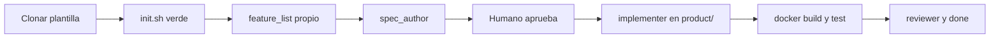

# Lead Trust Copilot

AI-powered lead scoring and trust analysis built on Next.js 14.

## Demo local — levantar el stack desde cero

### Prerrequisitos

- [Docker Desktop](https://www.docker.com/products/docker-desktop/) instalado y con el daemon activo.
- Una clave de API de Anthropic (obtener en <https://console.anthropic.com/>).

### Pasos

```bash
# 1. Clonar el repositorio
git clone <repo-url> lead-trust-copilot
cd lead-trust-copilot

# 2. Crear el archivo de variables de entorno
cp .env.example .env
# Editar .env y completar ANTHROPIC_API_KEY con tu clave real

# 3. Construir la imagen (primera vez tarda ~2 min)
docker build -f docker/Dockerfile -t lead-trust-copilot .

# 4. Levantar el servicio
docker-compose -f docker/docker-compose.yml up lead-trust-copilot

# 5. Abrir en el navegador
#    http://localhost:3000
```

Para detenerlo:

```bash
docker-compose -f docker/docker-compose.yml down
```

### Variables de entorno

| Variable | Requerida | Descripcion |
|----------|-----------|-------------|
| `ANTHROPIC_API_KEY` | Si | Clave de API para el scoring con Claude |
| `NODE_ENV` | No | Fijada en `production` por el Dockerfile |

El archivo `.env` nunca debe commitearse. Solo se versiona `.env.example`.

---

# R2D2-Harness — Spec-driven harness for cooperative AI agent teams

> *Cooperative agents. Spec before launch. Trust, but verify.*

Plantilla **Harness Engineering** dockerizada para **clonar y arrancar productos nuevos**
con agentes de IA, Spec Driven Development (SDD) y ciclo de vida completo en **Docker /
Docker Compose**.

Como su homónimo de *Star Wars*, el astromech que mantiene la misión en marcha: cada
agente tiene un rol acotado y fiable; el **leader** coordina sin implementar. Cada
feature empieza con un **briefing** (spec), pausa para **aprobación humana**, y solo
entonces toca código.

Este repositorio es el **arnés vacío** (specs, progress, agentes, docker).
Al clonarlo creas un repo donde el **producto crece dentro de la misma
estructura** — en `product/` y `tests/` — y se empaqueta, ejecuta, testea
y detiene desde contenedores.

## Prerrequisitos

- [Docker Desktop](https://www.docker.com/products/docker-desktop/) (daemon activo)
- [Git](https://git-scm.com/) con `user.name` y `user.email` configurados
- [GitHub CLI](https://cli.github.com/) con sesión activa (`gh auth login`)

## Empezar un producto nuevo

1. **Clona** esta plantilla en un repo nuevo:

   ```bash
   git clone https://github.com/ChamoCode/R2D2-Harness.git mi-producto
   cd mi-producto
   ```

   O usa el botón **Use this template** en [GitHub](https://github.com/ChamoCode/R2D2-Harness).

2. **Pre-flight checks** — verifica el entorno:

   ```bash
   ./init.sh          # Linux, macOS, Git Bash / WSL
   ./init.ps1         # Windows PowerShell nativo
   ```

3. **Define tu mission log** en `feature_list.json` (usa [`skills/feature-list/SKILL.md`](skills/feature-list/SKILL.md)):
   reemplaza las features de migración por las de **tu producto** (cada una con
   `"sdd": true` y `layer`: `backend`, `frontend`, `fullstack`, etc.).

4. **Arranca SDD** con tu agente (Claude Code, Cursor, etc.):

   > «Implementa la siguiente feature pendiente»

5. **Aprueba cada spec** en `specs/<feature>/` antes de que se escriba código (go/no-go humano).

6. El **implementer** (o `backend_implementer` / `frontend_implementer` según `layer`
   en `feature_list.json`) crea código en `product/` y tests en `tests/`.
   El **docker_manager** mantiene imágenes y servicios compose.

7. **Build, test, run y stop** del producto en Docker:

   ```bash
   ./docker/scripts/product-build.sh
   ./docker/scripts/product-test.sh
   ./docker/scripts/product-up.sh      # arrancar
   ./docker/scripts/product-down.sh    # detener
   ```



## Dónde vive el producto

| Ruta | Rol |
|------|-----|
| `product/backend/` | API, servicios, dominio server-side |
| `product/frontend/` | UI, client, assets |
| `tests/backend/` | Tests backend |
| `tests/frontend/` | Tests frontend |
| `docker/Dockerfile.product` | Imagen del producto |
| `docker/docker-compose.yml` | Servicios `app` y `test` (perfil `product`) |
| `specs/<feature>/` | Spec SDD por feature |
| `feature_list.json` | Backlog / mission log de tu producto |

En la plantilla, `product/` y `tests/` están vacíos (solo `.gitkeep`).
Aparecen al implementar la primera feature.

## Estructura del repositorio

```
.
├── AGENTS.md              # Mapa para agentes
├── CHECKPOINTS.md         # Criterios de estado final
├── CLAUDE.md              # Rol leader + subagentes
├── feature_list.json      # Backlog: una feature a la vez
├── init.sh / init.ps1     # Verificación del host
├── product/               # backend/ + frontend/ (SDD)
├── tests/                 # backend/ + frontend/
├── skills/                # feature-list, agent-author
├── specs/<feature>/       # Spec por feature (Kiro-style)
├── progress/              # Sesión activa + historial
├── docs/                  # Arquitectura, SDD, Docker, verificación
├── docker/
│   ├── Dockerfile.harness   # Imagen del arnés (verify)
│   ├── Dockerfile.product   # Imagen del producto
│   ├── docker-compose.yml
│   └── scripts/
│       ├── verify.sh        # Validación del arnés
│       ├── product-build.sh
│       ├── product-test.sh
│       ├── product-up.sh
│       └── product-down.sh
└── .claude/agents/        # leader, spec_author, implementers, reviewers, docker_manager
```

## Skills del arnés

| Skill | Uso |
|-------|-----|
| [`skills/feature-list/`](skills/feature-list/SKILL.md) | Crear o editar `feature_list.json` y campo `layer` |
| [`skills/agent-author/`](skills/agent-author/SKILL.md) | Crear o modificar agentes en `.claude/agents/` |

Indice: [`skills/README.md`](skills/README.md).

## Ciclo de vida Docker

| Acción | Comando |
|--------|---------|
| Validar arnés | `./init.sh` o `./docker/scripts/verify.sh` (vía contenedor harness) |
| Construir imagen del producto | `./docker/scripts/product-build.sh` |
| Ejecutar tests del producto | `./docker/scripts/product-test.sh` |
| Arrancar producto | `./docker/scripts/product-up.sh` |
| Detener producto | `./docker/scripts/product-down.sh` |

Detalle en [`docs/docker.md`](docs/docker.md).

## Flujo SDD

Ver [`AGENTS.md`](AGENTS.md):

`pending → spec_author → spec_ready → humano → in_progress → implementer_* / docker_manager → reviewer_* → done`

## Dos roles del mismo esqueleto

| Rol | Qué contiene |
|-----|--------------|
| **Plantilla** (este repo) | Arnés completo; historial de migración en `feature_list.json` |
| **Repo de producto** (tu clon) | Misma estructura + `feature_list.json` con **tus** features; `product/` y `tests/` crecen con SDD |
